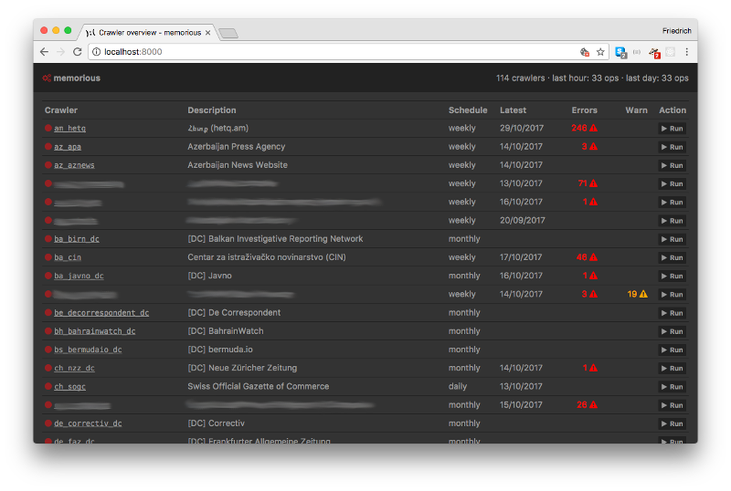

# Installation (running your own crawlers)

We recommend using [Docker Compose](https://docs.docker.com/compose/) to run your crawlers in production, and we have an [example project](https://github.com/alephdata/memorious/tree/master/example) to help you get started.

* Make a copy of the `memorious/example` directory.
* Add your own crawler YAML configurations into the `config` directory.
* Add your Python extensions into the `src` directory (if applicable).
* Update `setup.py` with the name of your project and any additional dependencies.
* If you need to (eg. if your database connection or directory structure is different), update any environment variables in the `Dockerfile` or `docker-compose.yml`, although the defaults should work fine.
* Run `docker-compose up -d`. This might take a while when it's building for the first time.

## Run a crawler

* You can access the Memorious CLI through the `worker` container:

```
docker-compose run --rm worker /bin/sh
```

To see the crawlers available to you:

```
memorious list
```

And to run a crawler:

```
memorious run my_crawler
```
See [Usage](https://memorious.readthedocs.io/en/latest/usage.html) (or run `memorious --help`) for the complete list of Memorious commands.

## Check worker logs

* You can check the worker logs:

```
docker-compose logs worker -f
```

## Access Memorious UI

* The Memorious UI is available at [http://localhost:8000/](http://localhost:8000/)




*Note: you can use any directory structure you like, `src` and `config` are not required, and nor is separation of YAML and Python files. So long as the `MEMORIOUS_CONFIG_PATH` environment variable points to a directory containing, within any level of directory nesting, your YAML files, Memorious will find them.*

## Environment variables

Your Memorious instance is configured by a set of environment variables that control database connectivity and general principles of how the system operates. You can set all of these in the `Dockerfile`.

* ``MEMORIOUS_CONFIG_PATH``: a path to crawler pipeline YAML configurations.
* ``MEMORIOUS_DEBUG``: whether to go into a simple mode with task threading disabled. Defaults to `False`.
* ``MEMORIOUS_INCREMENTAL``: executing part of a crawler only once per an interval. Defaults to `True`.
* ``MEMORIOUS_EXPIRE``: how many days until cached crawled data expires. Defaults to 1 day.
* ``MEMORIOUS_DB_RATE_LIMIT``: maximum number of database inserts per minute. Defaults to 6000.
* ``MEMORIOUS_HTTP_RATE_LIMIT``: maximum number of http calls to a host per minute. Defaults to 120.
* ``MEMORIOUS_SCHEDULER_INTERVAL``: how many seconds to wait in-between before checking whether any scheduled crawlers are available to run. Defaults to 60.
* ``MEMORIOUS_HTTP_CACHE``: HTTP request configuration.
* ``MEMORIOUS_USER_AGENT``: Custom User-Agent string for Memorious.
* ``MEMORIOUS_DATASTORE_URI``: connection path for an operational database (which crawlers can send data to using the `db` method). Defaults to a local `datastore.sqllite3`.

* ``MEMORIOUS_MAX_SCHEDULED``: maximum number of scheduled crawlers to run at the same time.

* ``WORKER_THREADS``: how many threads to use for execution.
* ``REDIS_URL``: address of Redis instance to use for crawler logs (uses a temporary FakeRedis if missing).
* ``ARCHIVE_TYPE``: either `file`(local file system is used for storage) or `s3`(Amazon S3 is used) or `gs`(Google Cloud Storage is used).
* ``ARCHIVE_PATH``: local directory to use for storage if `ARCHIVE_TYPE` is `file`
* ``ARCHIVE_BUCKET``: bucket name if `ARCHIVE_TYPE` is `s3` or `gs`
* ``AWS_KEY_ID``: AWS Access Key ID. (Only needed if `ARCHIVE_TYPE` is `s3`)
* ``AWS_SECRET``: AWS Secret Access Key. (Only needed if `ARCHIVE_TYPE` is `s3`)
* ``AWS_REGION``: a regional AWS endpoint. (Only needed if `ARCHIVE_TYPE` is `s3`)

* ``ALEPH_HOST``, default is `https://data.occrp.org/`, but any instance
  of Aleph 2.0 or greater should work.
* ``ALEPH_API_KEY``, a valid API key for use by the upload operation.

## Shut it down

To gracefully exit, run `docker-compose down`.

Files which were downloaded by crawlers you ran, Memorious progress data from the Redis database, and the Redis task queue, are all persisted in the `build` directory, and will be reused next time you start it up. (If you need a completely fresh start, you can delete this directory).

## Building a crawler

To understand what goes into your `config` and `src` directories, check out the [examples](https://github.com/alephdata/memorious/tree/master/example) and [reference documentation](https://memorious.readthedocs.io/en/latest/buildingcrawler.html).

### Crawler Development mode

When you're working on your crawlers, it's not convenient to rebuild your Docker containers all the time. To run without Docker:

* Copy the environment variables from the `env.sh.tmpl` to `env.sh`. Make sure ``MEMORIOUS_CONFIG_PATH`` points to your crawler YAML files, wherever they may be.
* Run `source env.sh`.
* Run `pip install memorious`. If your crawlers use Python extensions, you'll need to run `pip install` in your crawlers directory as well
* Run `memorious list` to list your crawlers and `memorious run your-crawler` to run a crawler.

*Note: In development mode Memorious uses a single threaded worker (because FakeRedis is single threaded). So task execution concurrency is limited and the worker executes stages in a crawler's pipeline linearly one after another.*

